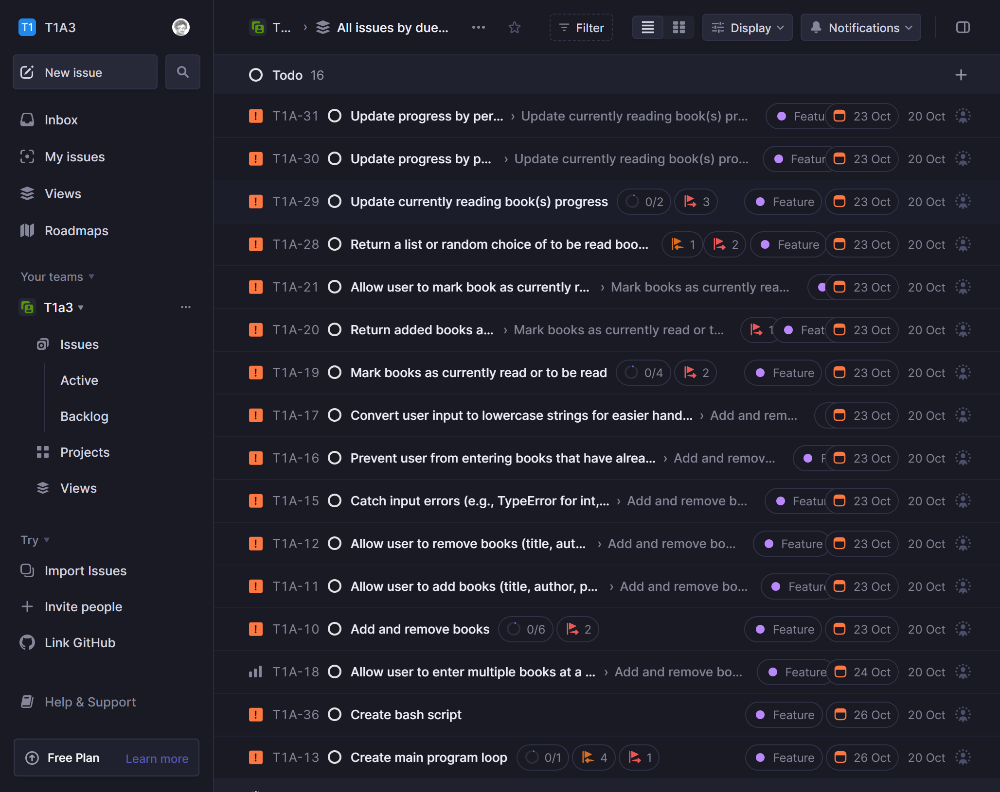
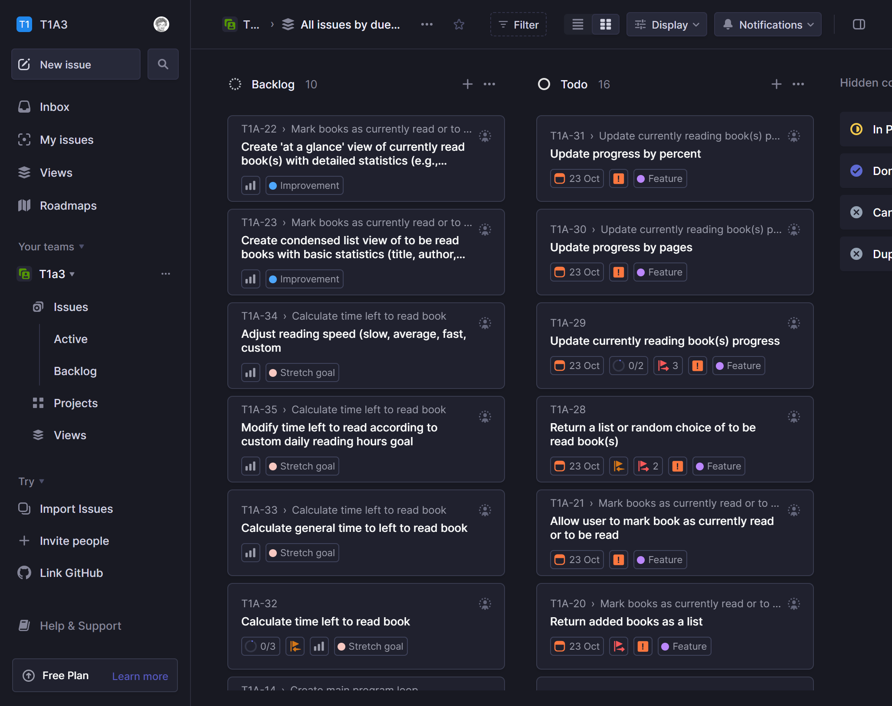
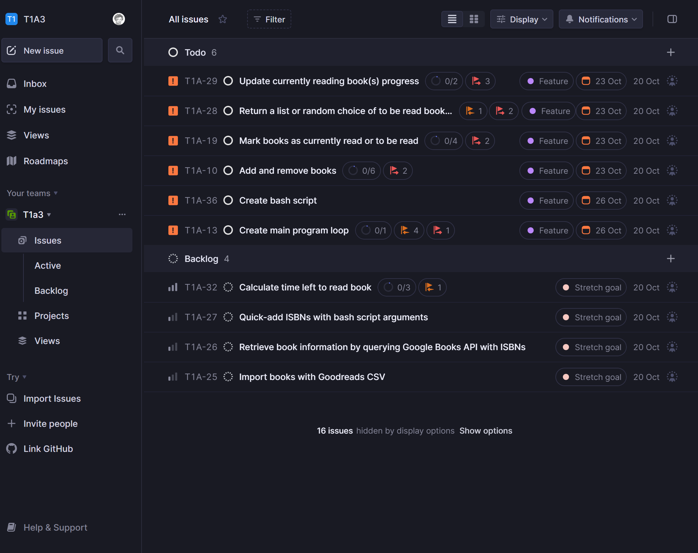
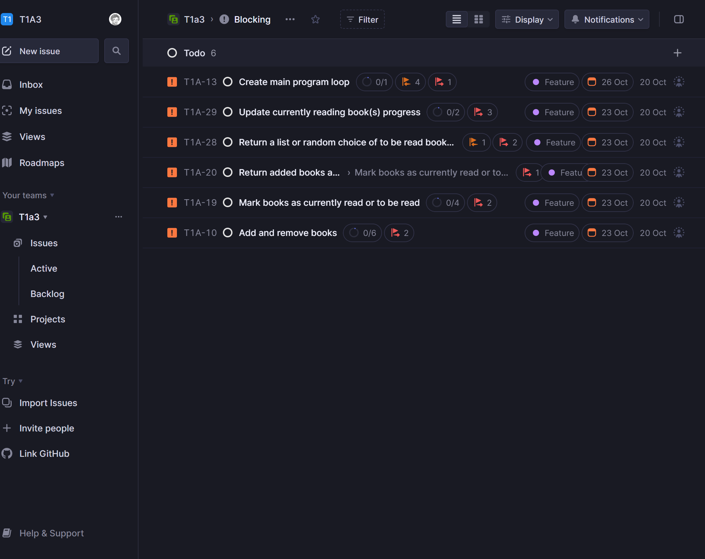
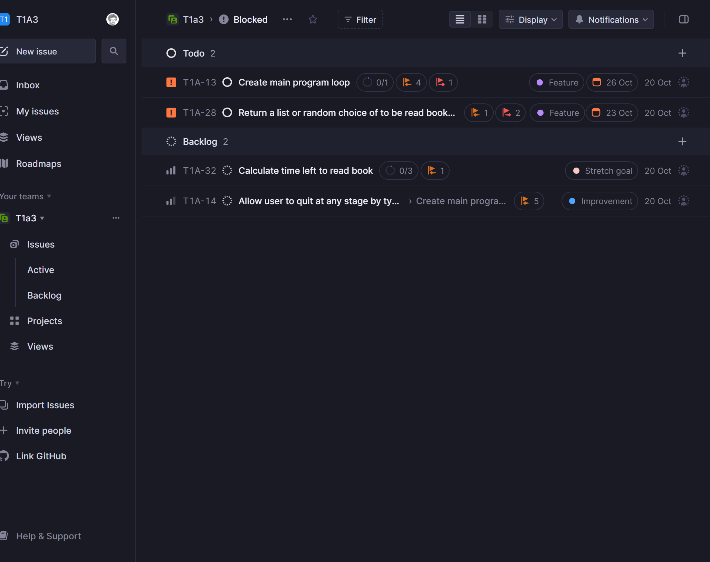
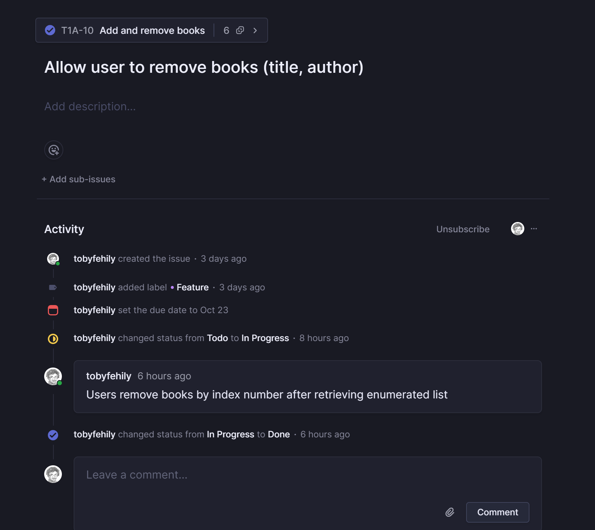
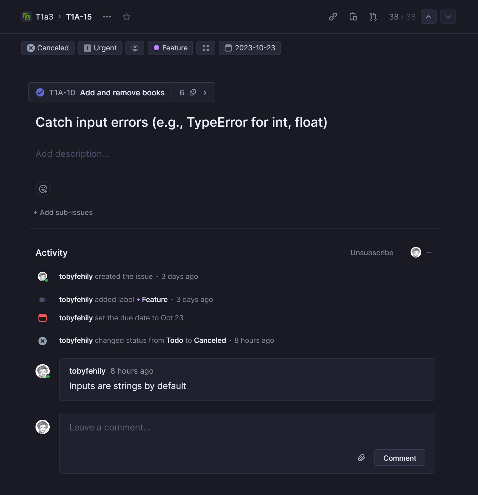

# Portfolio Assignment T1A3 — TBR Manager — Toby Fehily
## Links
- [GitHub repo](https://github.com/tobyfehily/T1A3)


## Style guide
This application follows the [PEP 8 – Style Guide for Python Code](https://peps.python.org/pep-0008/) (van Rossum, Warsaw & Coghlan 2001).

While the code adheres to the 79-character limit suggested by the style guide, some f-strings exceed this limit. This is still in accordance with the PEP 8 Style Guide.

As van Rossum, Warsaw and Coghlan explain, under 'A Foolish Consistency is the Hobgoblin of Little Minds' in the style guide, "...know when to be inconsistent – sometimes style guide recommendations just aren't applicable. When in doubt, use your best judgment." Further, they state that a good reason to ignore a guideline would include "when applying the guideline would make the code less readable, even for someone who is used to reading code that follows this PEP".

Breaking the f-strings to meet the recoommended 79-character limit would make the code less readable, so I have decided to avoid the "foolish consistency" that is the "hobgoblin of little minds" here and allow this exception.


## Features
### Add books
The user can add books to the database to keep track of what they want to read.

The user provides the following information when adding a book:
- Title
- Author
- Pages
- Tags, e.g., fiction/non-fiction, genre, subject (optional)

### Remove books
The user can remove a book from the database if they have finished it or no longer want to read it.

### Mark books as currently reading
The user can mark books as currently reading to distinguish between books they are reading and books they want to read.

### Update book progress
The user can update their progress with a book to stay informed about how long they have left to go.

They can update progress by providing either the page number they are up to or the percentage read. The application will notify the user about how many pages they have remaining.

### List all books
The user can list all the books in the database to see what they want to read at a glance.

The list provides the following information about each book:
- Title
- Author
- Pages
- Pages/percent read
- Currently reading status
- Tags

### List books by tag
The user can list books by tag to filter results by criteria of their choice, e.g., fiction/non-fiction, genre, subject

### Pick a random book
The user can randomly generate a book if they can not decide what they want to read.

### Export to CSV and TXT
On exiting, the application automatically exports the database to a CSV and a TXT file. The user can use the CSV with spreadsheet software such as Microsoft Excel, and use the TXT file as an easy-to-read shopping list.

### Save to and load from JSON
On starting, the application loads the book list from a JSON file, and on exiting, saves to the JSON file. This preserves the book list between sessions. 

## Implementation plan
The implementation plan was tracked using the project management tool [Linear](https://linear.com).

At the outset, the key features and task checklists included:
- Add and remove books
  - Allow user to add books
  - Allow user to remove books
  - Convert user input to lowercase strings for easier handling and cross-referencing
  - Prevent user from entering books that have already been added
  - Return confirmation that book has been added/removed
- Mark books as currently read
  - Return book list
  - Allow user to mark book as currently read
  - Prevent IndexError when accessing book out of range
  - Prevent negative integers accessing incorrect book in range
  - Show book as currently reading when accessing list
- Update book progress
  - Update book by page
  - Update book by percent
  - Prevent invalid inputs, e.g., pages and percent out of range
  - Delete book if progress indicates book has finished
  - Show pages remaining

Over the course of development, these key features and task checklists changed.

Detailed information about the daily progress of each feature and checklist item and sub-item has been captured in the following CSVs:

[Friday 20 October](/docs/AllIssues_20Oct.csv)

[Monday 23 October](/docs/AllIssues_23Oct.csv)

[Tuesday 24 October](/docs/AllIssues_24Oct.csv)

[Wednesday 25 October](/docs/AllIssues_25Oct.csv)

The following screenshots provide an indication of how development was organised and managed:

  
*All issues by due date*

  
*All issues by due date*

  
*All issues by Kanban view*

  
*Parent issues*

  
*Blocking issues*

  
*Blocked issues*

  
*Commented issue*

  
*Commented issue*


## Help

### Instructions

1. Save the `src` folder to your computer

2. Open your terminal application

3. Navigate to the `src` folder on your computer in your terminal application

4. Copy and paste the following lines of code into your terminal application, then press Enter:
```
./tbrmanager.sh
chmod +x tbrmanager.sh 
```


### Dependencies
This application uses the Python package [emoji 2.8.0](https://pypi.org/project/emoji/).

If you do not have this package, or are running an older version, the application will automatically install or upgrade it when launching.

This application also uses a number of built-in libraries from Python's standard library, which are included with Python.


### Requirements
#### Recommended hardware requirements:
- Windows 8 or later
- macOS X 10.11 or higher
- Linux RHEL 6/7, Ubuntu

#### Software requirements:
- Python 3
  - If you do not have Python 3, or are running an older version, the application wil automatically or install it when launching.
- A terminal application


## References
Rossum, G van, Warsaw, B & Coghlan, A 2001, *PEP 8 – Style Guide for Python Code*, viewed 26 October 2023, https://peps.python.org/pep-0008/